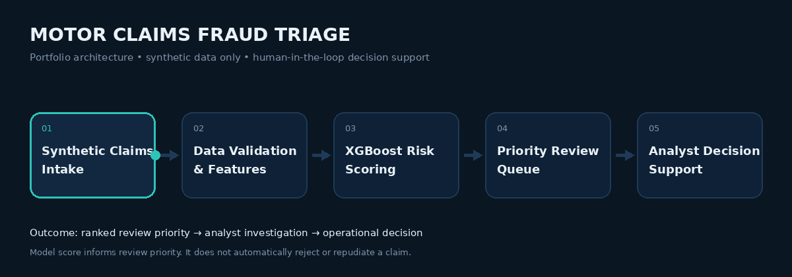

# Gareth Andrew Mackenzie

**Insurance Analytics · Data & BI · Fraud Detection · Process Optimization**

Turning insurance operations data into clear decisions, stronger controls, and measurable process improvement.

Johannesburg, South Africa

[Email](mailto:gamackenzie@live.com) · [LinkedIn](https://www.linkedin.com/in/gareth-andrew-mackenzie-50407b52/) · [GitHub](https://github.com/GarethMackenzie)

---

## Professional Profile

I work at the intersection of **insurance operations, claims analytics, risk, and process improvement**. My background combines hands-on claims experience with applied analytics using Python, SQL, Power BI, Excel, and machine-learning techniques.

I focus on practical questions: where risk is concentrated, which work should be reviewed first, how processes can be measured and improved, and how analytical outputs can support sound operational judgement.

## Professional Impact

> These outcomes relate to professional claims and operations work. They are separate from the synthetic portfolio project below.

| Area | Outcome |
|---|---:|
| Claims handling | **40% faster** following process redesign |
| Fraud identified / prevented | **R500K+** |
| Claims managed | **~200 motor and agricultural claims per month** |

## Core Capabilities

- Insurance and claims analytics
- Fraud-risk triage and review prioritization
- Business intelligence and operational reporting
- Process optimization and performance measurement
- Data quality, controls, and risk-aware decision support
- Stakeholder communication across operational and technical teams

## Technical Stack

| Area | Tools |
|---|---|
| **Analytics & Programming** | Python · SQL · R · Excel / VBA |
| **Business Intelligence & Visualization** | Power BI · Tableau · Chart.js |
| **Machine Learning** | scikit-learn · XGBoost · SMOTE |
| **Delivery & Tooling** | Streamlit · Git · GitHub |

## Flagship Portfolio Case Study

### Motor Claims Fraud Triage

**Portfolio project — synthetic data only.** No customer, policyholder, claim, or employer-confidential data is used.

The case study asks a practical insurance question:

> How can a claims team concentrate limited review capacity on higher-risk claims without treating a model score as an automatic fraud decision?

The workflow generates synthetic claims, validates and prepares features, scores claim-level risk with XGBoost, and ranks claims for human review. SMOTE is applied to the training fold only, after the train/test split, to avoid evaluation leakage.

**[View the project, tests, and executed notebook →](https://github.com/GarethMackenzie/motor-claims-triage)**

### Portfolio Model Performance

> Reproducible results from the public project. These describe one synthetic test set—not production performance or professional business outcomes.

| Metric | Result |
|---|---:|
| Test claims | **2,000** |
| Synthetic positive-label rate | **4.65%** |
| ROC-AUC | **0.719** |
| Precision at top-10% review capacity | **12.5%** |
| Recall at top-10% review capacity | **26.9%** |
| False-positive rate at top-10% review capacity | **9.2%** |
| Lift over random review | **2.7×** |

A fixed 0.5 threshold produces **95.2% accuracy but 0% recall** on the current synthetic test set. The result illustrates why imbalanced classification should be evaluated against operational review capacity, not headline accuracy alone. See the project’s [generated metrics](https://github.com/GarethMackenzie/motor-claims-triage/blob/main/results/metrics.json) and [documented limitations](https://github.com/GarethMackenzie/motor-claims-triage#limitations).

## Fraud Detection Pipeline

**Model score → review priority → analyst investigation → operational decision.** The model informs the queue; it does not automatically reject, decline, or repudiate a claim.

## Claims Intelligence Dashboard

The repository includes a responsive Chart.js dashboard that translates the verified synthetic-model results into an operational review-capacity view. It demonstrates class imbalance, capacity trade-offs, an illustrative review queue, and explicit human-in-the-loop controls.

**[View the dashboard source →](./claims-dashboard.html)**

> Portfolio demo — synthetic data only. The dashboard is not a live employer system and contains no customer, policyholder, claim, or employer-confidential information.

## Professional Experience

- **Insurance Specialist — Old Mutual Insure** · Oct 2023 – Present
- **Claims Specialist — Auto & General Australia** · Oct 2022 – Jun 2023
- **Customer Support Specialist — Bob Group** · Oct 2021 – Sep 2022
- **Associate Claims Coordinator — Innovation Group South Africa** · Sep 2018 – Aug 2020

## Education & Professional Development

- **UNISA** — Business Administration
- **UNISA** — Higher Certificate in Insurance, NQF Level 5
- **South-West Gauteng College** — Management, NQF Level 4
- **Lean Six Sigma Black Belt**

Credential links will be added only when a public verification record is available.

## Career Focus

I am interested in roles where analytics, insurance domain knowledge, and operational problem-solving need to work together.

**Target areas:** Data Analytics · Business Intelligence · Insurance Analytics · Risk Analytics · Fraud Analytics · Operations Analytics

---

**Data → Insight → Decision → Impact**

[Email](mailto:gamackenzie@live.com) · [LinkedIn](https://www.linkedin.com/in/gareth-andrew-mackenzie-50407b52/) · [GitHub](https://github.com/GarethMackenzie)

